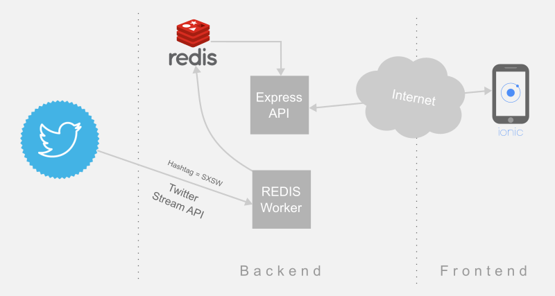

# Twitter Stream

## [Express API + Worker](express-api)
  1. Redis worker service that using twitter stream api gets and index tweets by a hashtag keyword.
  1. Api layer on express to access (tweet list, search, vote on tweet).

## [Frontend: Ionic Framework](ionic)
  1. Mobile app consuming Express API
  1. Features: List tweets, Search by hashtag, List favorites, Show recommendations based on votes, Swipe left and right to fav tweets
  1. [Click here to run a Heroku hosted version](http://redis-twitter-stream-ionic.herokuapp.com)
  1. [Click here to run a Pivotal hosted version](http://rl-dave.cfapps.io/)

# Redis usage

## Data types and abstractions
  1. auths (hash: uuid, userId)
  1. user_next_id (string: lastUserId )
  1. tweetIndex:**CHANNEL** (hash: tweetId, content)
  1. hashtagIndex:**CHANNEL** (zset: tweetId, hashtagScore )
  1. tweetSet:**CHANNEL** (set:  tweetIds)
  1. voteIndex:**CHANNEL** (zset: tweetId, votes)
  1. likeSet:**USERID**:**CHANNEL** (set: tweetId)
  1. nopeSet:**USERID**:**CHANNEL** (set: tweetId)
  1. swipedSet:**USERID**:**CHANNEL** (set: tweetId)

## Functions
  1. findRecommendations: Top ten voted tweets
    **ZREVRANGE(voteIndex:CHANNEL ,0,9)**
  1. findLikes: Search likes for user on channel
    **SMEMBERS(likeSet:USERID:CHANNEL)**
  1. findNopes: Search nopes for user on channel
    **SMEMBERS(nopeSet:USERID:CHANNEL)**
  1. voteTweet:
    **ZINCRBY(voteIndex:CHANNEL, 1, tweetId)**
  1. findToSwipe: List All tweets (but not swiped ones)
    **SDIFF(tweetSet:CHANNEL, UNIONSTORE(nopeSet:USERID:CHANNEL, likeSet:USERID:CHANNEL))**
  1. findViewed: List All tweets( but not nope)
    **SDIFF(tweetSet:CHANNEL, nopeSet:USERID:CHANNEL)**
  1. findByHashtag: Search by hashtag
    **ZRANGEBYSCORE(hashtagIndex:CHANNEL, hashtag, hashtag, LIMIT, offset, count)**
